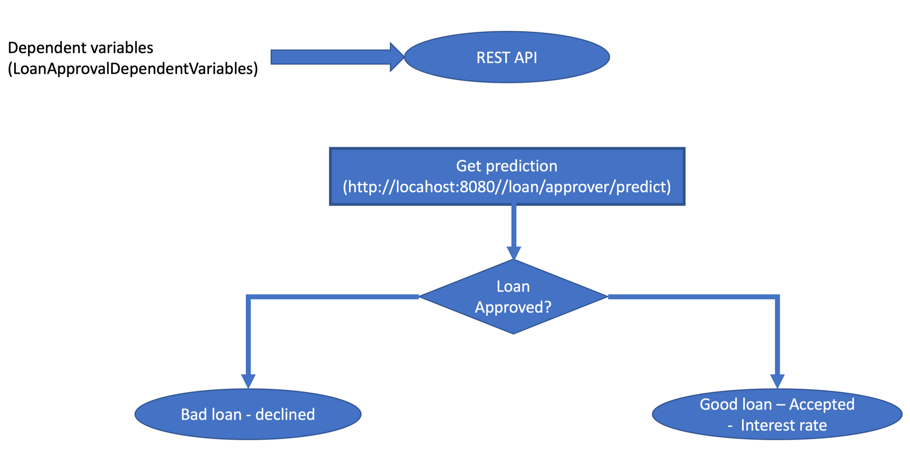
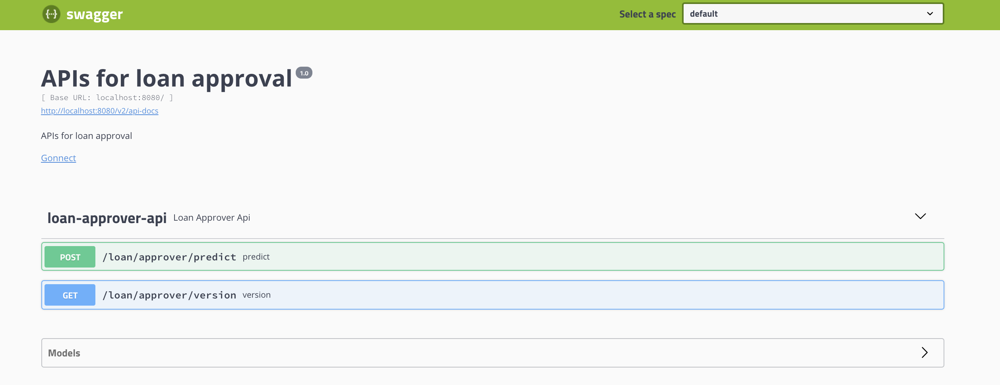

# Smart Application - Loan Approver

Smart applications are those that learns from data. A Loan Approver is smart application which will use ML for loan approving. Learning from the data is achieved using two predictive model:

- Find whether loan being predicted is atrocious  (yes/no)

- If the loan is atrocious, what interest to be offered?

This will achieved in following steps:

- Step 1: Create a model which will answer the question.
- Step 2: Find data which will help in creating the model
- Step 3: Once the model is created, it will be exported as Java POJO
- Step 4: Then the compile the Java based model using Gradle
- Step 5: Deploy this model on Spring Boot (Tomcat)
- Step 6: Expose answer to the question as REST API and also self contained Swagger UI

## Data Model

| Predictor Variable               | Description                                 | Units        |
|----------------------------------|---------------------------------------------|--------------|
| loan_amnt                        | Requested loan amount                       |  US dollars  |
| term                             | Loan term length                            |  months      |
| emp_length                       | Employment length                           |  years       |
| home_ownersh                     | Housing status                              |  categorical |
| annual_inc                       | Annual income                               |  US dollars  |
| verification_status              | Income verification status                  |  categorical |
| purpose                          | Purpose for the loan                        |  categorical |
| addr_state                       | State of residence                          |  categorical |
| dti                              | Debt to income ratio                        |  %           |
| delinq_2yrs                      | Number of delinquencies in the past 2 years |  integer     |
| revol_util                       | Revolving credit line utilized              |  %           |
| total_acc                        | Total accounts (number of credit lines)     |  integer     |
| longest_credit_length            | Age of oldest active account                |  years       |

 
 Dependent Variable                | Description                                 | Model Category         |
|----------------------------------|---------------------------------------------|------------------------|
| bad_loan                         | Is the loan like to be bad? => approved?    | Binomial Classification|
| int_rate                         | Predicted loan rate                         | Regression             |


Following picture shows flow of this smart loan approver application:



## Model Information

| Atrocious Loan Model                         | Interest Rate Model                              |
|----------------------------------------------|--------------------------------------------------|
|**_Algorithm_**:      GBM                     |**_Algorithm_**:      GBM                         |
|**_Model Category_**: Binary                  |**_Model Catelgory_**:      Regression            |
|                      Classification          |                                                  |
|**_ntrees_**: 100                             |**_ntrees_**: 100                                 | 
|**_max_depth_**: 5                            |**_max_depth_**: 5                                |
|**_learn_rate_**: 0.05                        |**_learn_rate_**: 0.05                            |
|**_AUC on valid_**: 0.685                     |**_MSE_**: 11.1                                   |
|**_Max F1_**: 0.2.2                           |**_R2_**:  0.424                                  |


## Tech Stack
- Build: Gradle
- ML: Python/R, H2o
- REST API: Java, Spring Boot

## Play Time
- Build project
    ```
     ./gradlew build                    # Run R script (loan-approver-model.R) to generate POJOs
     ./gradlew build -PusePython=true   # Run Python script (loan-approver-model.py) to generate POJOs
    ```
    
- Run Load Approver Spring Boot Application

    ```
     java -jar loanapprover-0.0.1-SNAPSHOT.jar
    ```

-  Swagger Definition of the Load Approver application
    ```
    http://localhost:8080/swagger-ui.html
    ```
    
    
#### Output
```
{
  "labelIndex": 0,
  "label": "0",
  "classProbabilities": [
    0.8777492684744649,
    0.12225073152553513
  ],
  "interestRate" : 12.079950220424134
}
```
    
##### NOTES
- label interpretation

| label                         |  meaning                             |
|-------------------------------|--------------------------------------|
|1                              | atrocious - bad loan - not approved  |
|0                              | good loan - approved                 |

- Download h2o-genmodel.jar and store it in lib folder
    ```
    curl http://192.168.1.20:54321/3/h2o-genmodel.jar > h2o-genmodel.jar
    ```


    
 
    


